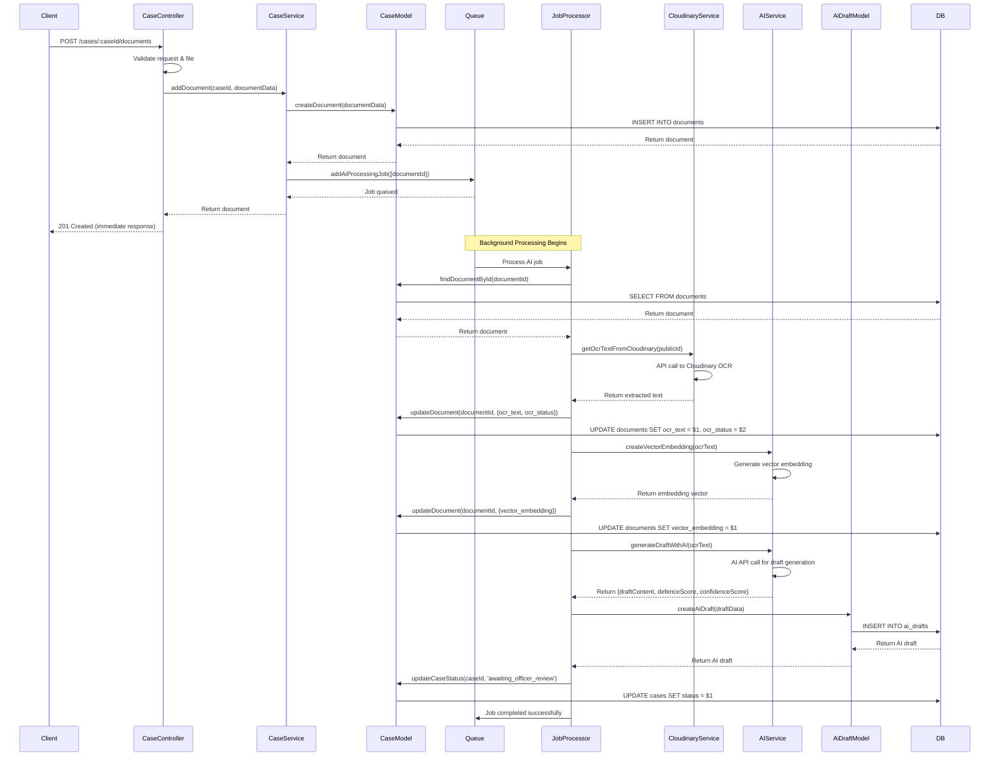

# AI Processing Flow and Architecture

This document outlines the complete flow for AI-powered document processing and draft generation in the Government Officers Defence system.

## Overview

The AI processing system enables automatic analysis of uploaded case documents through OCR text extraction, vector embedding creation, and AI-generated defence drafts. The system uses background job processing with BullMQ and Redis to handle resource-intensive AI operations asynchronously.

## Architecture Components

### 1. Queue System (src/jobs/queue.ts)

- **BullMQ Queue**: Uses Redis for job persistence and distribution
- **Job Types**: AI processing jobs for document analysis
- **Configuration**: Retry logic, backoff strategies, and connection pooling

### 2. Job Processor (src/jobs/processors/aiDraftProcessor.ts)

- **Background Worker**: Processes AI jobs asynchronously
- **Pipeline Steps**:
  - Document metadata retrieval
  - OCR text extraction from Cloudinary
  - Vector embedding generation
  - AI draft creation
  - Database updates and status changes

### 3. Services Layer

- **Cloudinary Service** (src/services/cloudinary.service.ts): OCR text extraction
- **AI Service** (src/services/ai.service.ts): Draft generation and embeddings

### 4. Data Models

- **Document Model**: Stores uploaded files and OCR results
- **AI Draft Model** (src/models/aiDraft.model.ts): Stores generated AI drafts
- **Case Model**: Links documents and drafts to cases

## Complete Flow Sequence



## Database Schema

### Documents Table

```sql
CREATE TABLE documents (
    id UUID PRIMARY KEY DEFAULT gen_random_uuid(),
    case_id UUID NOT NULL REFERENCES cases(id),
    original_filename TEXT,
    cloudinary_public_id TEXT NOT NULL,
    secure_url TEXT NOT NULL,
    file_type TEXT,
    file_size_bytes INTEGER,
    ocr_text TEXT,
    ocr_status TEXT DEFAULT 'pending', -- 'pending', 'completed', 'failed'
    vector_embedding VECTOR(1536), -- pgvector extension
    uploaded_at TIMESTAMP DEFAULT NOW()
);
```

### AI Drafts Table

```sql
CREATE TABLE ai_drafts (
    id UUID PRIMARY KEY DEFAULT gen_random_uuid(),
    case_id UUID NOT NULL REFERENCES cases(id),
    version INTEGER NOT NULL,
    content TEXT NOT NULL,
    defence_score DECIMAL(5,2),
    confidence_score DECIMAL(5,2),
    created_at TIMESTAMP DEFAULT NOW(),
    updated_at TIMESTAMP DEFAULT NOW()
);
```

### Cases Table (Updated Status)

```sql
-- Existing cases table with additional status values
ALTER TYPE case_status ADD VALUE 'awaiting_officer_review';
-- Status values: 'intake', 'under_review', 'awaiting_officer_review', 'approved', 'rejected'
```

## Service Interfaces

### Cloudinary Service

```typescript
interface CloudinaryService {
  getOcrTextFromCloudinary(publicId: string): Promise<string>;
}
```

### AI Service

```typescript
interface AiResult {
  draftContent: string;
  defenceScore: number;
  confidenceScore: number;
}

interface AIService {
  generateDraftWithAI(text: string): Promise<AiResult>;
  createVectorEmbedding(text: string): Promise<number[]>;
}
```

## Job Processing Details

### Job Data Structure

```typescript
interface AiProcessingJobData {
  documentId: string;
}
```

### Processor Flow Steps

1. **Document Retrieval**: Fetch document metadata and case information
2. **OCR Processing**: Extract text from uploaded document via Cloudinary
3. **Text Cleaning**: Apply text processing utilities (fix broken words, normalize content)
4. **Vector Embedding**: Generate semantic embeddings for similarity search
5. **AI Draft Generation**: Create defence draft using AI model
6. **Database Updates**: Save OCR results, embeddings, and AI draft
7. **Status Updates**: Change case status to notify officers

### Error Handling

- **Retry Logic**: Jobs retry up to 3 times with exponential backoff
- **Error Logging**: All failures logged with context
- **Status Updates**: Failed jobs update document/ case status appropriately
- **Cleanup**: Failed OCR or AI calls don't block the pipeline

## Integration Points

### Case Service Updates

```typescript
class CaseService {
  static async addDocument(
    caseId: string,
    documentData: DocumentInput
  ): Promise<Document> {
    // Create document record
    const document = await CaseModel.createDocument(documentData);

    // Enqueue AI processing job
    await addAiProcessingJob({ documentId: document.id });

    return document;
  }
}
```

### Queue Configuration

```typescript
const aiProcessingQueue = new Queue("ai-processing", {
  connection: redisConfig,
  defaultJobOptions: {
    attempts: 3,
    backoff: {
      type: "exponential",
      delay: 5000,
    },
  },
});
```

## Monitoring and Observability

### Logging

- Job start/completion events
- API call timings and results
- Error details with stack traces
- Performance metrics

### Queue Monitoring

- Job counts (waiting, active, completed, failed)
- Processing times and throughput
- Redis connection health

### Database Monitoring

- AI draft generation statistics
- OCR success/failure rates
- Case status transition tracking

## Security Considerations

- **Input Validation**: Sanitize all text inputs before AI processing
- **Rate Limiting**: Prevent abuse of AI services
- **Access Control**: Ensure users can only process their own case documents
- **Data Privacy**: Handle sensitive case information appropriately

## Future Enhancements

- **Real AI Integration**: Replace mock services with actual AI APIs
- **Batch Processing**: Process multiple documents in single job
- **Progress Tracking**: Real-time job progress updates via WebSockets
- **Quality Assurance**: Human review workflows for AI-generated content
- **Analytics**: Usage patterns and performance insights

## Deployment Considerations

- **Worker Scaling**: Multiple worker instances for high throughput
- **Redis Clustering**: For production scalability
- **Database Indexing**: Optimize queries for document and draft retrieval
- **Monitoring Setup**: Alerting for job failures and performance issues
