# All Routes Flow: Controller-Service-Model

This document provides sequence diagrams for the flow of data through Controller -> Service -> Model for all API routes in the application.

## Authentication Routes

### POST /api/v1/auth/register

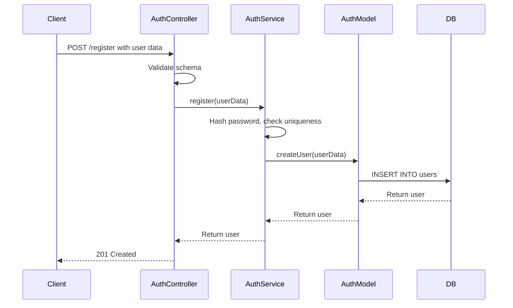

### POST /api/v1/auth/login

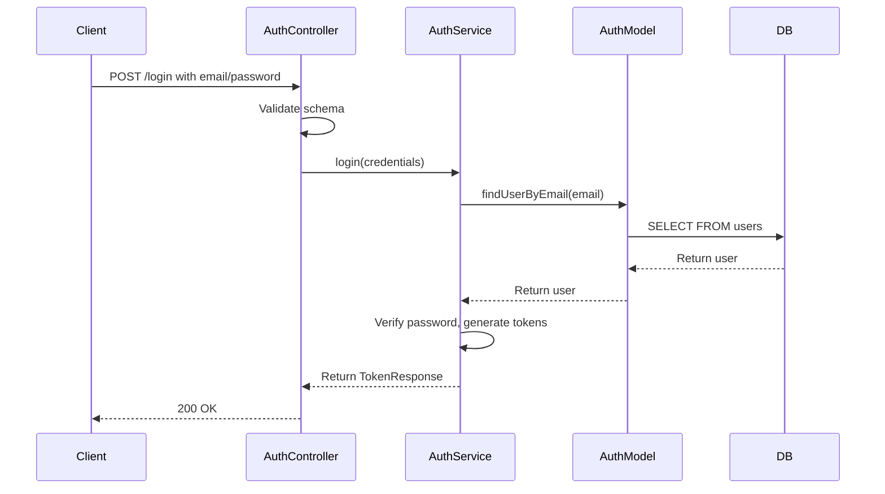

### POST /api/v1/auth/refresh-token

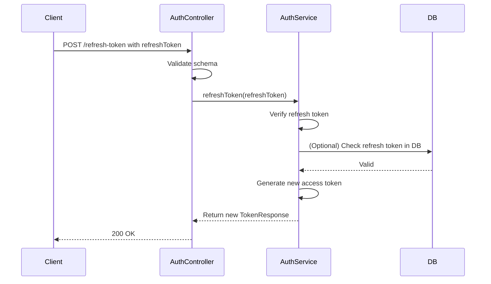

## User Routes

### GET /api/v1/users/me

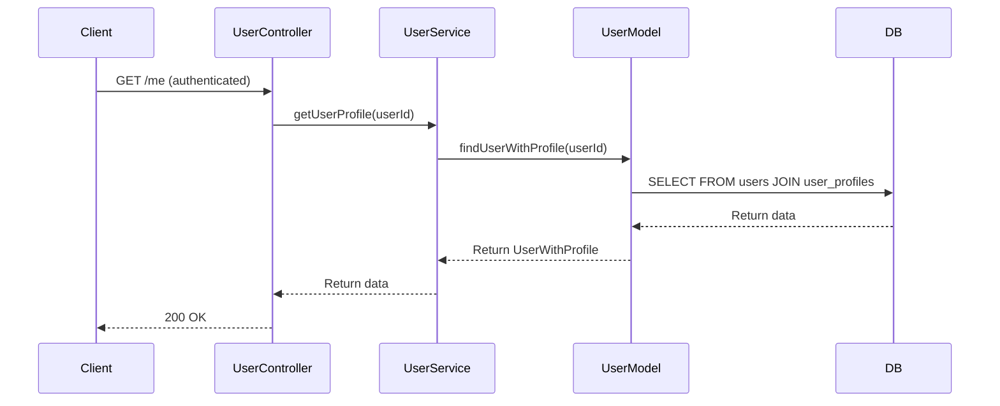

### PUT /api/v1/users/me

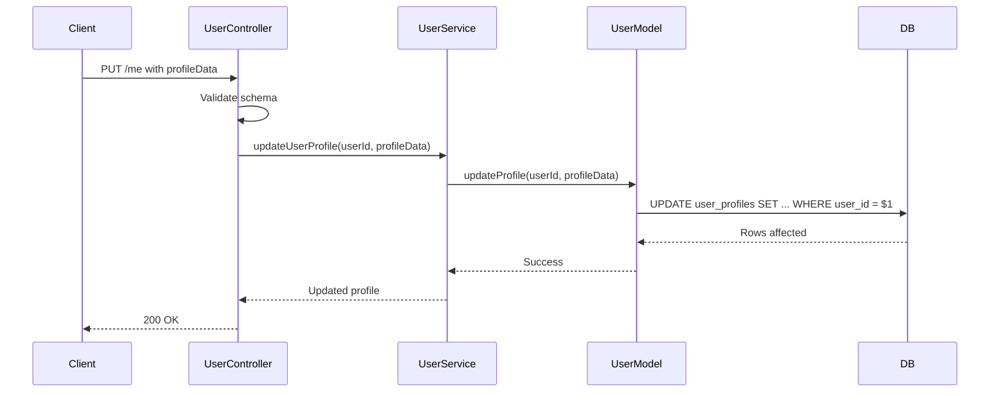

## Case Routes

### POST /api/v1/cases

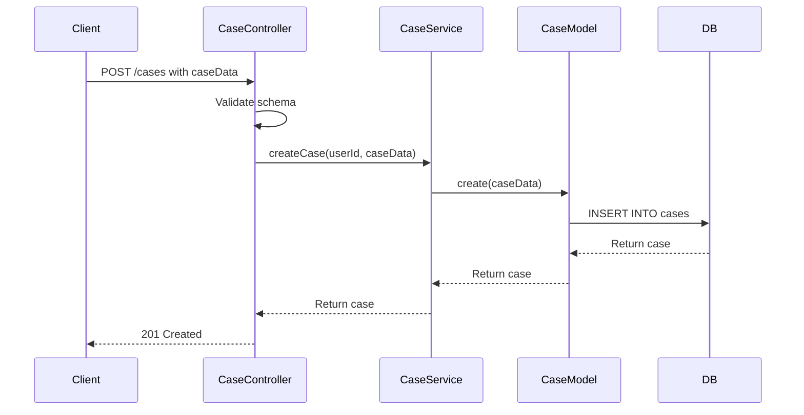

### GET /api/v1/cases

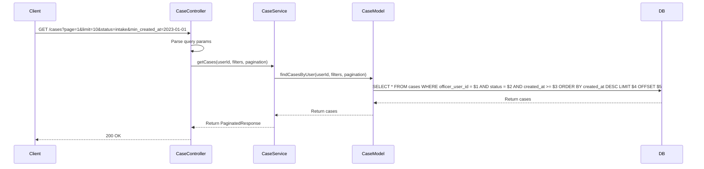

### GET /api/v1/cases/:caseId

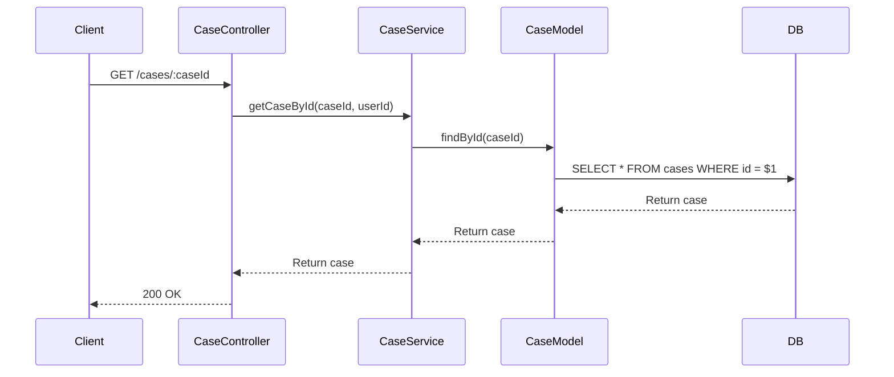

### POST /api/v1/cases/:caseId/documents

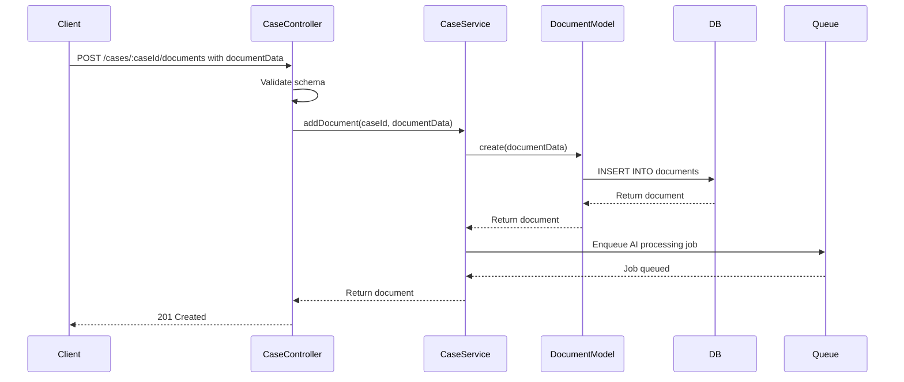

### POST /api/v1/cases/:caseId/review

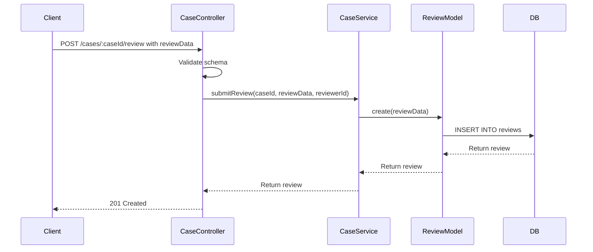

## Plan Routes

### GET /api/v1/plans

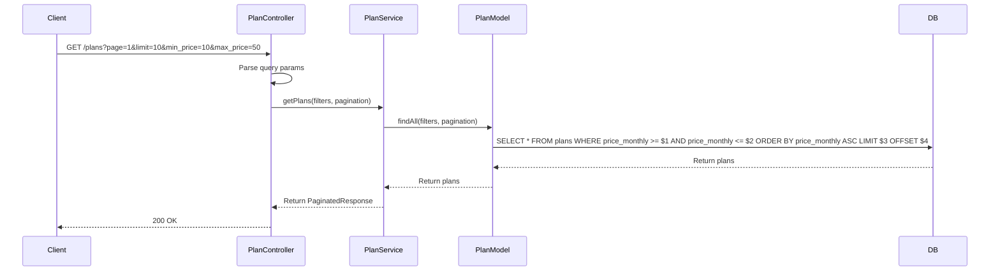

### POST /api/v1/plans (Admin)

Create new plan.

### PUT /api/v1/plans/:id (Admin)

Update plan.

### DELETE /api/v1/plans/:id (Admin)

Delete plan.

## Subscription Routes

### GET /api/v1/subscriptions

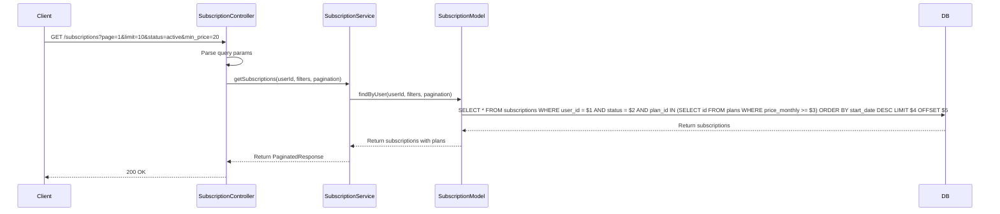

### POST /api/v1/subscriptions

Create subscription (admin only).

### PUT /api/v1/subscriptions/:id

Update subscription (admin only).

### DELETE /api/v1/subscriptions/:id

Cancel subscription (admin only).

## Admin Routes

### GET /api/v1/admin/users

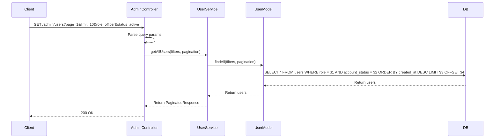

### PUT /api/v1/admin/users/:userId/status

Update user status.

### GET /api/v1/admin/cases

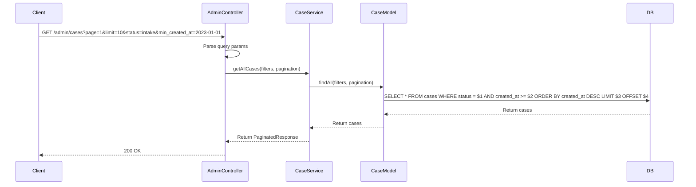

### GET /api/v1/admin/subscriptions

Similar to GET /subscriptions, but for all users.

### POST /api/v1/admin/subscriptions

Create subscription for any user.

### PUT /api/v1/admin/subscriptions/:id

Update any subscription.

### DELETE /api/v1/admin/subscriptions/:id

Cancel any subscription.

### GET /api/v1/admin/plans

List all plans with filters.

### PUT /api/v1/admin/plans/:id

Update plan.

### DELETE /api/v1/admin/plans/:id

Delete plan.

### GET /api/v1/admin/audit-logs

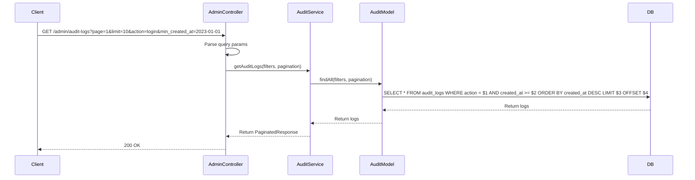

## General Notes

- All routes use authentication middleware to attach user to req.
- Role-based access uses hasRole middleware.
- Subscription features checked where applicable.
- Rate limiting applied to all routes.
- Usage tracking for metered features.
- Errors handled with custom AppError and sent as JSON.
- Database operations use raw SQL with parameterized queries.
