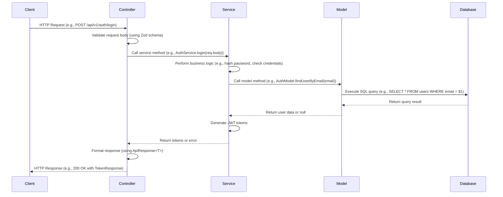

# Controller-Service-Model Flow

This document outlines the typical flow of data and operations in the application's layered architecture: Controller -> Service -> Model.

## Sequence Diagram

## Flow Description

1. **Client Request**: The client sends an HTTP request to an endpoint (e.g., login).

2. **Controller Layer**:

   - Receives the request.
   - Validates the request body using a Zod schema.
   - Calls the appropriate service method, passing validated data.

3. **Service Layer**:

   - Contains business logic.
   - May perform additional validations, transformations, or computations.
   - Calls one or more model methods to interact with the database.
   - Handles errors and returns data or throws exceptions.

4. **Model Layer**:

   - Responsible for database interactions.
   - Executes raw SQL queries or uses an ORM.
   - Returns database results to the service layer.

5. **Response**: Data flows back through the layers, formatted into an API response.

## Key Principles

- **Separation of Concerns**: Each layer has a distinct responsibility.
- **Dependency Injection**: Services and models are injected or imported as needed.
- **Error Handling**: Errors are caught and handled at appropriate layers, often using custom error classes.
- **Type Safety**: TypeScript interfaces ensure type safety across layers.

## Example for Case Creation

For creating a case (POST /api/v1/cases):

1. Controller: Validates case data, checks user role.
2. Service: Creates case record, initializes audit log.
3. Model: Inserts into `cases` table, returns new case ID.
4. Response: Returns created case data.
