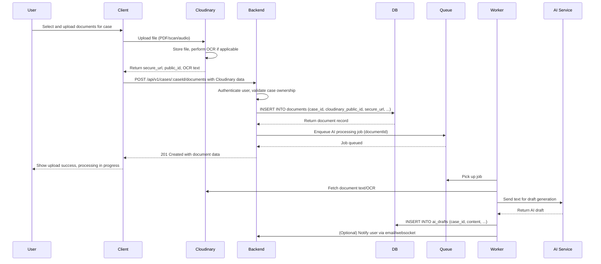

# Document Upload Flow

This document outlines the business-level flow for handling document uploads by users in the case management system.

## Business Process Overview

1. **User Initiates Upload**: Officer selects documents (PDF, scans, audio notes) for a specific case.
2. **Client-Side Processing**: Client uploads files to Cloudinary for storage and OCR processing.
3. **Backend Validation**: Server validates the upload request and associates the document with the case.
4. **Database Storage**: Document metadata is saved in the database.
5. **Asynchronous AI Processing**: Job is enqueued to process the document with AI for draft generation.
6. **Notification**: User is notified of successful upload and processing status.

## Sequence Diagram

## Key Components

- **Cloudinary**: Handles file storage, provides secure URLs, and performs OCR on images/PDFs.
- **Backend API**: Validates requests, saves metadata, enqueues jobs.
- **BullMQ Queue**: Manages asynchronous processing to avoid blocking the API response.
- **AI Worker**: Processes documents in background, generates drafts, updates database.
- **Database**: Stores document metadata and AI-generated content.

## Error Handling

- If Cloudinary upload fails, client retries or shows error.
- If backend validation fails (e.g., invalid case), return 400/403.
- If job enqueue fails, log error, but still return success to user.
- Worker failures are retried via BullMQ.

## Security Considerations

- Files are uploaded directly to Cloudinary with signed requests.
- Backend verifies user has access to the case.
- Sensitive documents are secured with access controls.

## Starting Point

To implement this, start with setting up Cloudinary configuration in `src/config/cloudinary.ts`, then implement the document upload route in `case.controller.ts` and `case.service.ts`.
