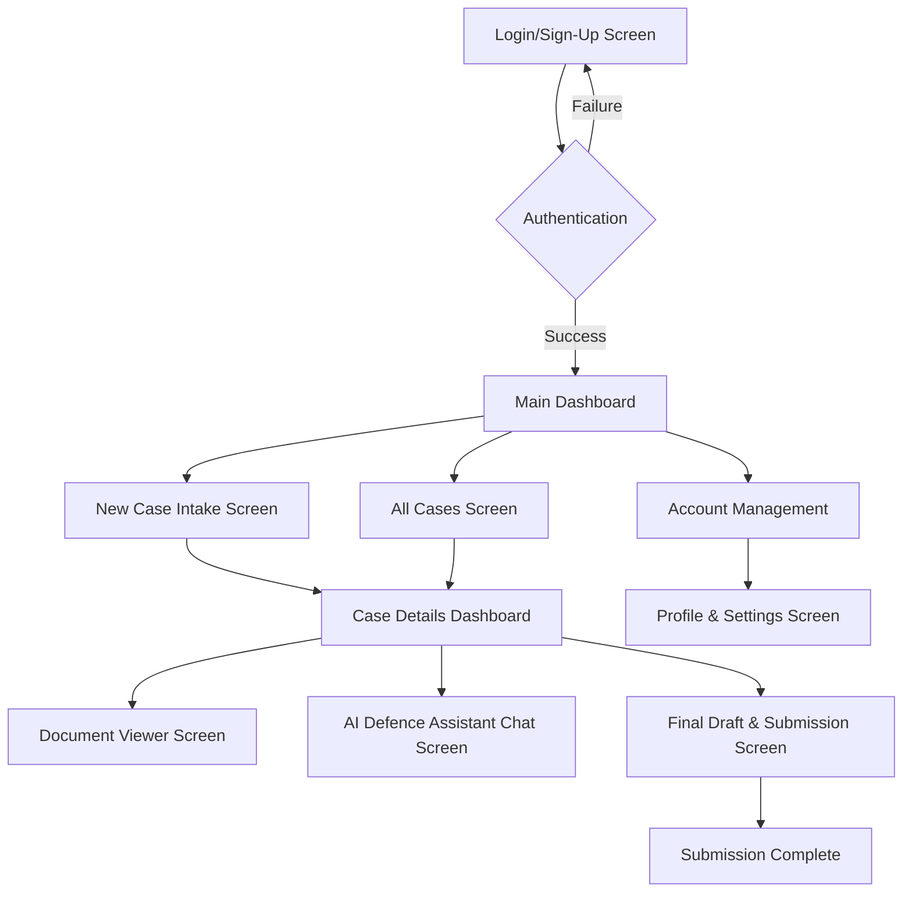
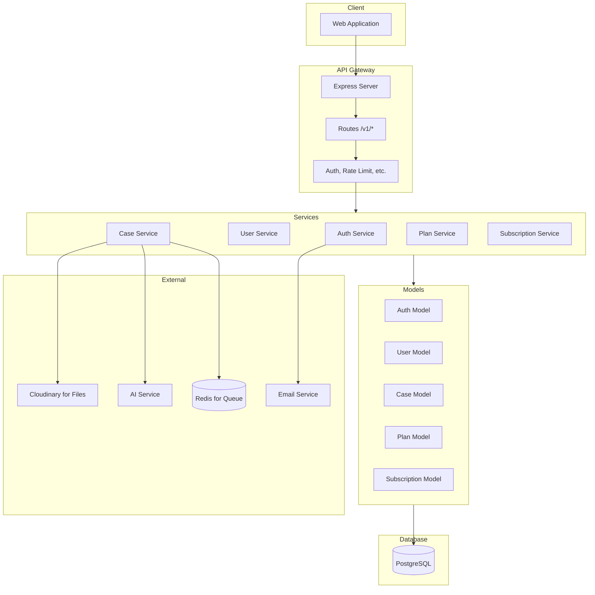

# Application Flow Diagram

## User Journey Flow for Officers



## Backend Flow for Case Creation

```mermaid
flowchart TD
    A[Client: POST /api/v1/cases] --> B[Route: case.routes.ts]
    B --> C[Middleware: authenticate]
    C --> D[Middleware: hasRole(['officer'])]
    D --> E[Controller: createCase]
    E --> F[Validation: Zod schema]
    F --> G[Service: CaseService.createCase]
    G --> H[Model: CaseModel.create]
    H --> I[Database: INSERT INTO cases]
    I --> J[Response: 201 Created]

    K[Document Upload] --> L[Client: POST /api/v1/cases/:caseId/documents]
    L --> M[Document Service: save to DB]
    M --> N[Enqueue AI Job: BullMQ]
    N --> O[Worker: aiDraftProcessor]
    O --> P[Fetch OCR from Cloudinary]
    P --> Q[Send to AI Service]
    Q --> R[Save AI Draft to DB]
```

## System Architecture Overview


