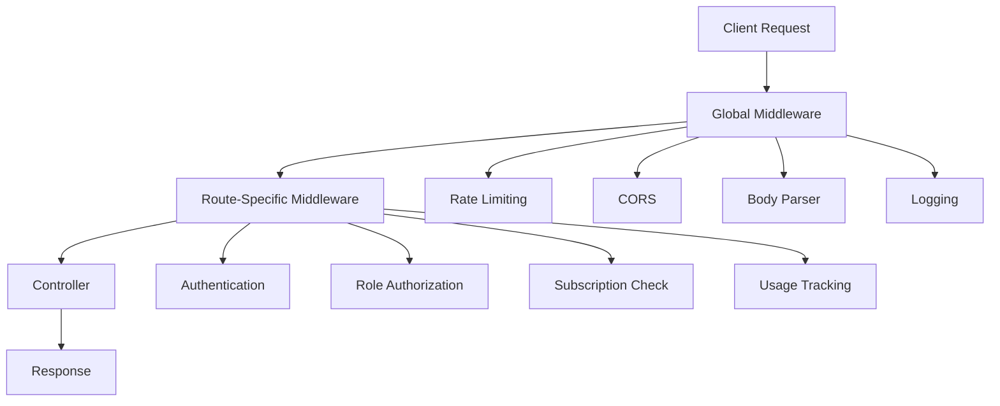
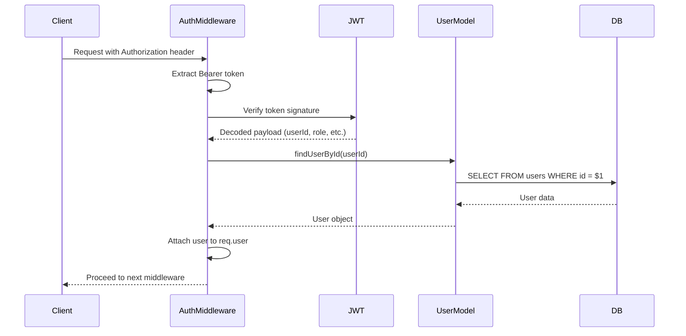
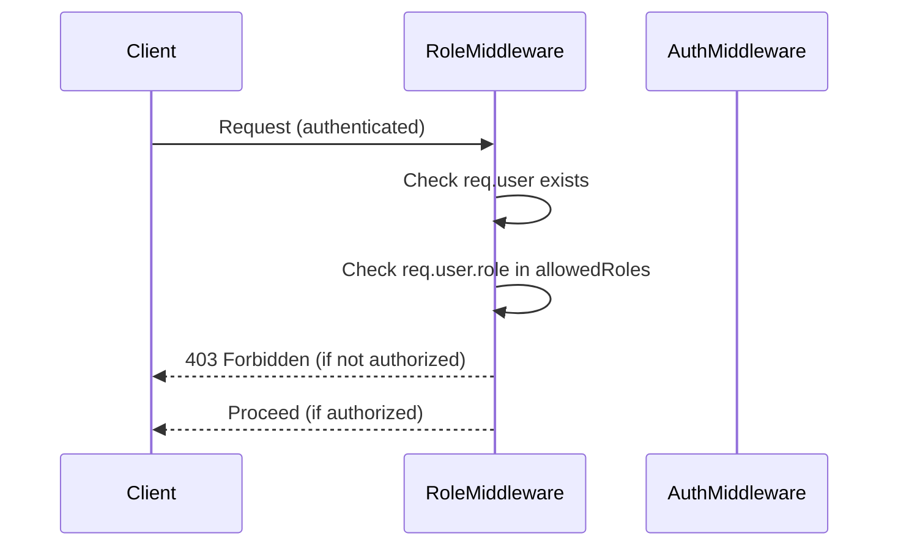
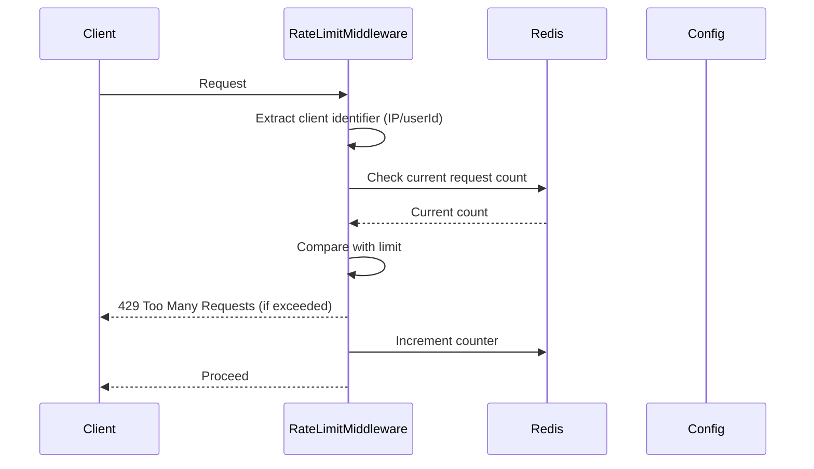
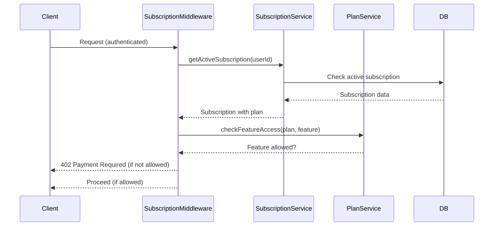
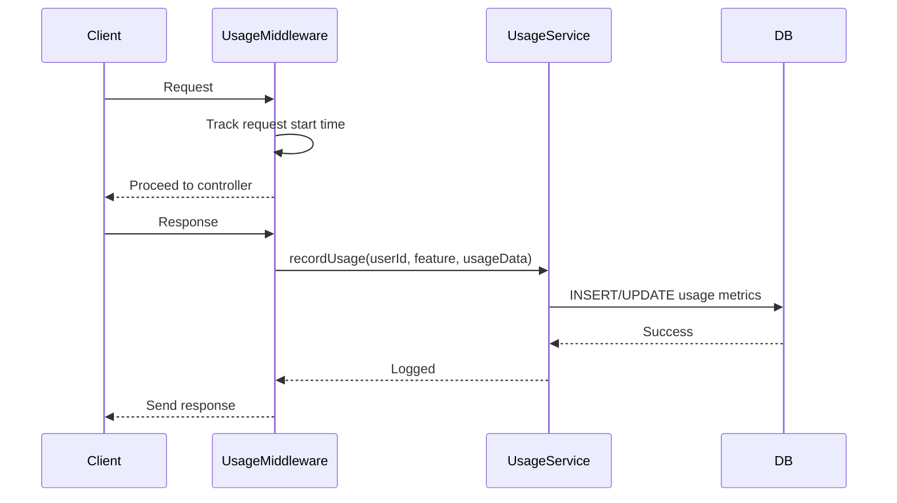

# Middleware Flow and Design

This document outlines the middleware architecture and flow for the API application.

## Overall Middleware Architecture



## Middleware Execution Order

1. **Global Middleware** (applied to all routes in `app.ts`)

   - Rate limiting (`rateLimitMiddleware`)
   - CORS handling
   - Body parsing (JSON, URL-encoded)
   - Request logging

2. **Route-Specific Middleware** (applied per route)
   - Authentication (`authenticate`)
   - Role-based access (`hasRole`)
   - Subscription feature checks (`subscriptionFeatureMiddleware`)
   - Usage tracking (`usageTrackingMiddleware`)

## Detailed Middleware Flows

### 1. Authentication Middleware (`authenticate`)



**Implementation Points:**

- Extract token from `Authorization: Bearer <token>` header
- Verify JWT using secret key
- Fetch user from database to ensure validity
- Attach user object to `req.user`
- Handle token expiry, invalid tokens, missing users

### 2. Role Authorization Middleware (`hasRole`)



**Implementation Points:**

- Requires `authenticate` middleware to run first
- Accepts array of allowed roles: `hasRole(['admin', 'officer'])`
- Returns 403 if user role not in allowed list
- Admin role should have access to all routes

### 3. Rate Limiting Middleware (`rateLimitMiddleware`)



**Implementation Points:**

- Use Redis for distributed rate limiting
- Different limits for different user roles
- Sliding window or fixed window algorithm
- Include retry-after header in 429 responses

### 4. Subscription Feature Middleware (`subscriptionFeatureMiddleware`)



**Implementation Points:**

- Check if user has active subscription
- Verify plan includes required features
- Different features: case creation, document upload, AI processing
- Graceful degradation or upgrade prompts

### 5. Usage Tracking Middleware (`usageTrackingMiddleware`)



**Implementation Points:**

- Track API calls, data usage, AI processing time
- Metered billing integration
- Usage limits enforcement
- Analytics and reporting

## Middleware Configuration

### Global Middleware (in `app.ts`)

```typescript
app.use(cors());
app.use(express.json());
app.use(express.urlencoded({ extended: true }));
app.use(rateLimitMiddleware);
app.use(requestLogger);
```

### Route-Specific Middleware Examples

```typescript
// Public routes
router.get("/plans", rateLimitMiddleware, planController.getPlans);

// Authenticated routes
router.get(
  "/users/me",
  authenticate,
  rateLimitMiddleware,
  subscriptionFeatureMiddleware,
  userController.getProfile
);

// Admin routes
router.get(
  "/admin/users",
  authenticate,
  hasRole(["admin"]),
  rateLimitMiddleware,
  adminController.getUsers
);

// Feature-restricted routes
router.post(
  "/cases",
  authenticate,
  rateLimitMiddleware,
  subscriptionFeatureMiddleware,
  usageTrackingMiddleware,
  caseController.createCase
);
```

## Error Handling in Middleware

All middleware should:

- Use `next(error)` for async errors
- Return appropriate HTTP status codes
- Include descriptive error messages
- Log security-related events

## Testing Middleware

- Unit tests for each middleware function
- Integration tests for middleware chains
- Load testing for rate limiting
- Security testing for authentication/authorization

## Next Steps

1. Implement authentication middleware with JWT verification
2. Add role-based authorization checks
3. Configure Redis-based rate limiting
4. Implement subscription feature validation
5. Add usage tracking and metrics
6. Write comprehensive tests for all middleware
