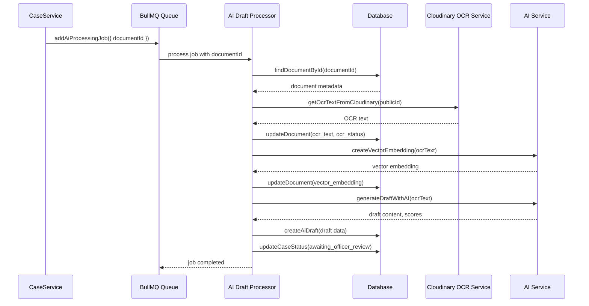

# AI Processing Queue Job Flow

This document describes the flow of the AI processing queue job implemented in the project.

## Overview

The AI processing queue handles background jobs for processing uploaded case documents. It performs OCR text extraction, vector embedding creation, AI draft generation, and updates the database accordingly.

## Components

- **Queue:** `src/jobs/queue.ts`

  - BullMQ queue named `ai-processing`
  - Uses Redis connection from `src/config/redis.config.ts`
  - Job data interface: `{ documentId: string }`
  - Function `addAiProcessingJob` to enqueue jobs

- **Job Processor:** `src/jobs/processors/aiDraftProcessor.ts`
  - Processes each job from the queue
  - Steps:
    1. Fetch document metadata by `documentId` from database (`CaseModel.findDocumentById`)
    2. Extract OCR text from Cloudinary (`getOcrTextFromCloudinary`)
    3. Update document with OCR text and status
    4. Create vector embedding from OCR text (`createVectorEmbedding`)
    5. Update document with vector embedding
    6. Generate AI draft from OCR text (`generateDraftWithAI`)
    7. Save AI draft to database (`AiDraftModel.createAiDraft`)
    8. Update case status to `awaiting_officer_review`
    9. Log success or handle errors and update document status to `failed`

## Flow Diagram

## Error Handling

- Jobs retry up to 3 times with exponential backoff (5 seconds initial delay)
- On failure, document OCR status is updated to `failed`
- Errors are logged with context for troubleshooting

## Integration Points

- The queue job is enqueued after document creation in the case service
- The job processor updates multiple tables: documents, ai_drafts, cases
- Uses services for OCR and AI draft generation (mock implementations)

## Summary

This queue job flow enables asynchronous AI processing of case documents, improving system responsiveness and scalability by offloading heavy AI tasks to background workers.
